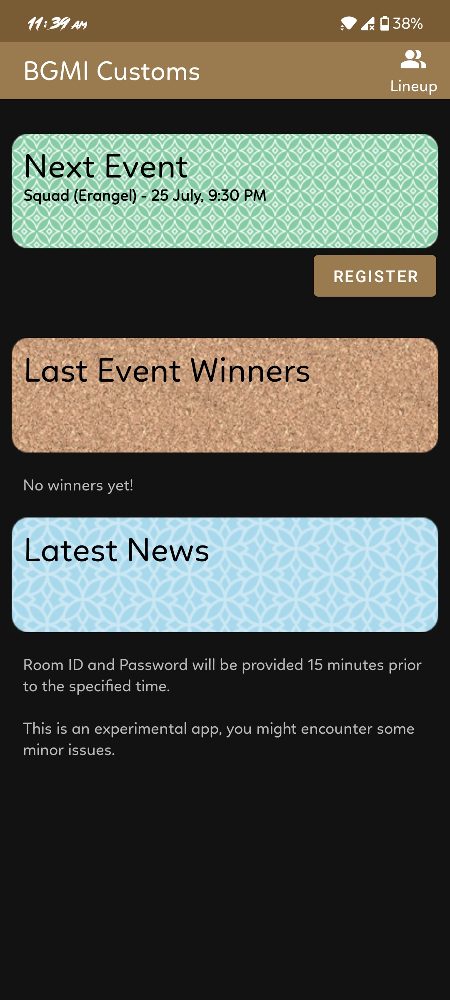

# BGMI Customs
An app to reserve slots for public pustom rooms in BGMI/PUBG

## Requirements
* At least API 23 (Android 6.0 Marshmallow)

## LICENSE
`Copyright (c) 2021 Gaurav Kumar Yadav`

Licensed under The MIT License
